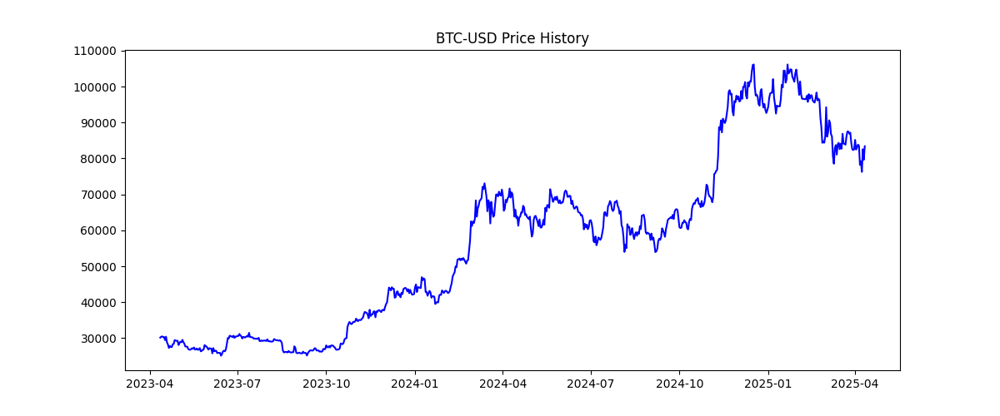
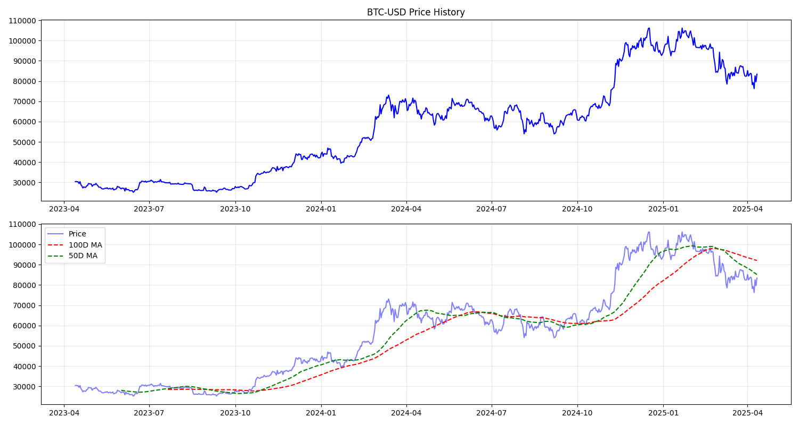
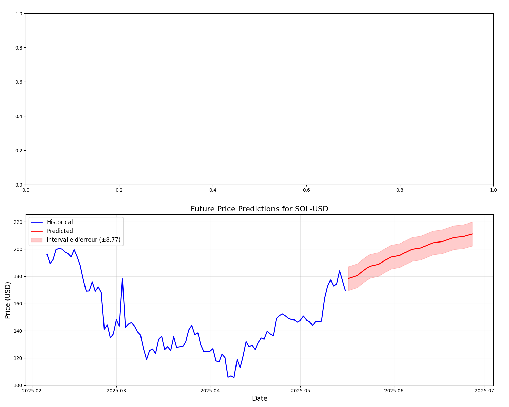
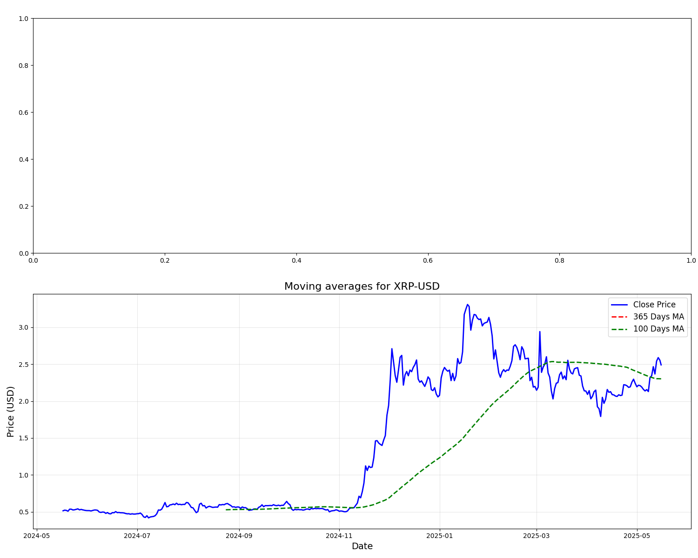

# Crypto Due Diligence

A web platform for researching, forecasting, and paper-trading cryptocurrencies. It combines an LLM-powered Q&A/report system over uploaded documents, LSTM price forecasting for BTC/ETH/SOL/XRP/HBAR, live market data, a spot & futures trading simulator, a crypto chatbot, and AI-assisted video generation — orchestrated with Apache Airflow and served through a Flask app.

## Introduction

The rise of cryptocurrencies and digital assets has transformed the financial landscape, presenting both opportunities and challenges. As more individuals and institutions engage with these assets, the need for a robust due diligence process becomes paramount. This project establishes a structured, data-driven methodology for evaluating digital assets — their legitimacy, market potential, and associated risks.

## Objectives

1. **Develop a Due Diligence Framework** — a structured approach to assess digital assets, including evaluation criteria and risk scoring.
2. **Identify Key Risk Factors** — analyze risks unique to digital assets: regulatory compliance, market volatility, and security vulnerabilities.
3. **Provide Educational Resources** — training materials to help stakeholders understand due diligence in the context of digital assets.
4. **Foster Collaboration** — encourage knowledge-sharing between industry experts, regulators, and academic institutions.

## Features

- **Document Q&A** — upload a PDF (e.g. a whitepaper or prospectus), auto-generate questions and answers over it via an Airflow DAG + Hugging Face inference, and export findings as a PPTX report.
- **Price Forecasting** — pre-trained Keras/TensorFlow LSTM models (`best_model_*.h5`) forecast BTC, HBAR, SOL, and XRP prices, with prediction and moving-average charts.
- **Live Market Dashboard** — real-time prices, market cap, and a Fear & Greed index via `yfinance` and public APIs.
- **Crypto Chatbot** — a domain-scoped assistant (Llama 3 via Ollama) that answers crypto-related questions and declines everything else.
- **Trading Simulator** — practice spot and futures trading with zero risk, using real-time prices, leverage, and liquidation checks.
- **AI Video Generation** — generates a short script (OpenAI) and pairs it with stock footage (Pexels) from a text prompt.
- **News Sentiment Pipeline** — an Airflow DAG scrapes Google News RSS and scores sentiment with VADER.

## Screenshots

| BTC — Price & Prediction | BTC — Combined View |
|---|---|
|  |  |

| SOL — Future Forecast | XRP — Moving Average |
|---|---|
|  |  |

More charts are available in [static/images/](static/images/) for each supported asset (BTC, ETH, SOL, XRP, HBAR).

## Architecture

```
Flask app (app.py) ──┬── MySQL (users, market data, Q&A, trading state)
                      ├── Apache Airflow (CeleryExecutor + Redis) — DAGs in dags/
                      │     ├── crypto_pipeline.py                (market data ETL)
                      │     ├── generate_questions_from_pdf.py    (PDF → Q&A)
                      │     ├── generate_questions_huggingface.py (Q&A generation via HF Inference API)
                      │     └── google_news_sentiment_analysis_rss.py (news sentiment)
                      ├── Keras/TensorFlow LSTM models (best_model_*.h5) — price forecasting
                      ├── Ollama (llama3) — chatbot.py
                      └── OpenAI + Pexels APIs — video.py
```

## Key Technologies

- **Language:** Python
- **Web framework:** Flask, Flask-SocketIO
- **Database:** MySQL
- **Orchestration:** Apache Airflow (CeleryExecutor, Redis broker)
- **ML/Forecasting:** TensorFlow/Keras, Keras Tuner, scikit-learn, pandas, numpy
- **LLMs:** Llama 3 (Ollama), GPT-4o, Hugging Face Inference API (RoBERTa/Flan-T5), VaderSentiment
- **Data/Reporting:** yfinance, Plotly, Matplotlib, python-pptx, pdfplumber

## Getting Started

### Prerequisites

- Docker & Docker Compose
- API keys for the services you want to use (OpenAI, Pexels, Hugging Face) — none are required just to browse the dashboard/simulator

### Setup

```bash
git clone https://github.com/<your-username>/crypto-due-diligence.git
cd crypto-due-diligence
cp .env.example .env   # fill in AIRFLOW_UID and any API keys you have
docker compose up --build
```

The Flask app is served at `http://localhost:5000`; the Airflow webserver at `http://localhost:8080`.

### Configuration

All secrets are read from environment variables (see `.env.example`) — never hardcode API keys in source. Local MySQL/Airflow credentials in `docker-compose.yaml` are development defaults for the internal Docker network; change them before any real deployment.

## Project Structure

```
app.py            Flask application & routes
charts.py         Chart generation / crypto analysis helpers
chatbot.py        Llama3 (Ollama) chatbot integration
video.py          OpenAI script + Pexels video generation
dags/             Airflow DAGs (ETL, Q&A generation, sentiment analysis)
templates/        Jinja2 templates (dashboard, simulator, chatbot, auth, etc.)
static/           CSS/JS assets and generated prediction charts
best_model_*.h5   Pre-trained LSTM forecasting models
docker-compose.yaml, Dockerfile   Container orchestration
```

## Disclaimer

This project is for educational and research purposes. Nothing here constitutes financial advice, and the trading simulator uses simulated funds only.
